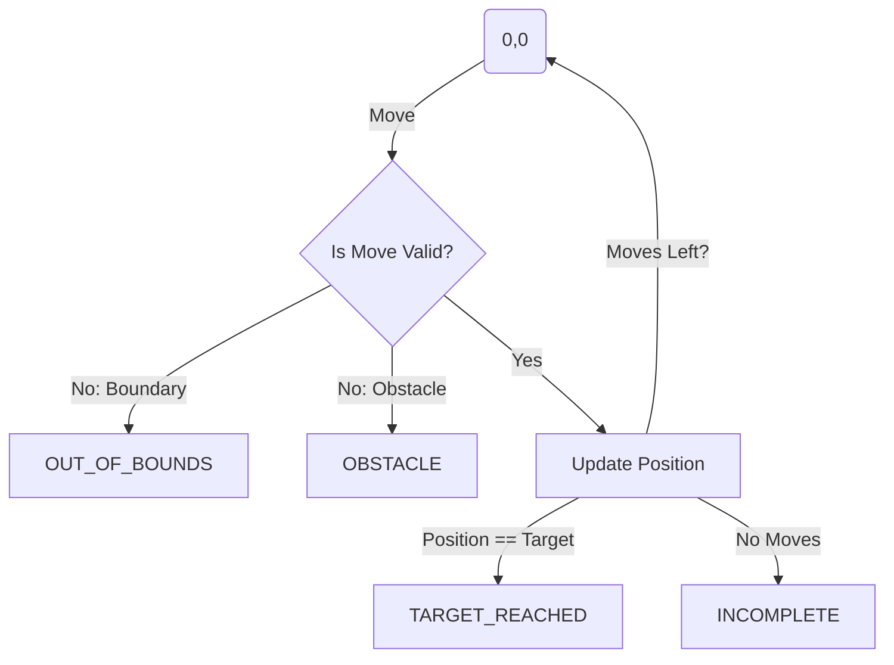
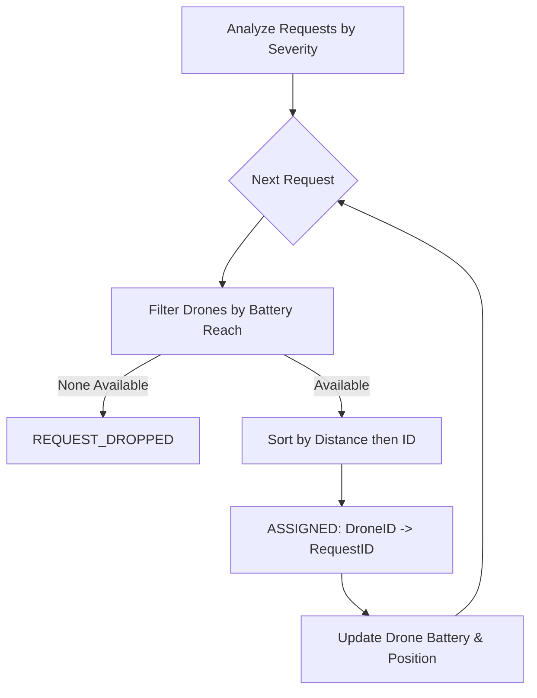

# ZYNOVA 2K26: PROBLEM STATEMENTS

## Level 0 - (Medium Complexity)

## 1. Cinema Dynamic Pricing
### Problem Statement
A theater implements a dynamic pricing model based on the customer's age and the timing of the show. Your task is to calculate the final ticket price based on the following rules:
- **Base Price:** Rs. 200.
- **Age Discounts:**
  - Children (Age < 12): 50% discount on the base price.
  - Senior Citizens (Age > 60): 30% discount on the base price.
- **Time Surcharge:** If the show is scheduled after 18:00 (6 PM), a flat surcharge of Rs. 50 is added to the final calculated price (after applying any age discounts).

### Constraints
- $0 \le \text{Age} \le 120$
- $0 \le \text{Show Hour} \le 23$

### Input Format
- An integer representing the Age.
- An integer representing the Show Hour (in 24-hour format).

### Output Format
- `Ticket Price: Rs. [Value]`

### Example
- **Input:** `10, 19`
- **Calculation:** Base (200) - 50% Discount (100) + Surcharge (50) = 150.
- **Output:** `Ticket Price: Rs. 150`

---

## 2. Smart Vending Machine
### Problem Statement
A smart vending machine needs to provide change to customers using the minimum number of coins. The machine is stocked with coins of denominations: Rs. 10, Rs. 5, Rs. 2, and Rs. 1.

### Constraints
- $\text{Item Price} \le \text{Amount Paid}$
- All inputs are non-negative integers.

### Input Format
- An integer representing the Item Price.
- An integer representing the Amount Paid by the customer.

### Output Format
- `Change: 10x[a], 5x[b], 2x[c], 1x[d]` (where a, b, c, d are the counts of each denomination).

### Example
- **Input:** `37, 100`
- **Calculation:** Total Change = 63. (6x10, 0x5, 1x2, 1x1).
- **Output:** `Change: 10x6, 5x0, 2x1, 1x1`

---

## 3. Robot Path Validator
### Problem Statement
A robot navigates a 10x10 warehouse grid, starting at coordinates (0,0). The grid boundaries are from index 0 to 9. The robot follows a sequence of movement commands: 'U' (Up), 'D' (Down), 'L' (Left), and 'R' (Right). 

The robot must navigate to a target location while avoiding obstacles. The system must monitor the robot's state and report its status based on the following conditions:
1. **TARGET_REACHED:** If the robot occupies the target coordinates at any point during its movement.
2. **OUT_OF_BOUNDS:** If a move would take the robot outside the 0-9 range.
3. **OBSTACLE:** If a move would take the robot into a coordinate marked as an obstacle.
4. **INCOMPLETE:** If the robot finishes all moves without hitting an obstacle, going out of bounds, or reaching the target.

### Constraints
- Grid size is fixed at 10x10.
- Robot starting position is always (0,0).

### Input Format
- Target X, Target Y (two integers)
- Number of Obstacles (integer)
- Obstacle coordinates (N pairs of x y integers)
- Moves String (sequence of characters 'U', 'D', 'L', 'R')

### Output Format
- A status message: `TARGET_REACHED`, `OUT_OF_BOUNDS at (x,y)`, `OBSTACLE at (x,y)`, or `INCOMPLETE at (x,y)`.

### Example
- **Input:** `2 2`, `1`, `1 1`, `RRUU`
- **Output:** `TARGET_REACHED`

### Visual Representation

---

## 4. Real-time Health Alert System
### Problem Statement
A health monitoring system tracks a patient's Heart Rate (HR) every minute. To ensure accuracy and filter out momentary spikes, the system analyzes data in 3-minute sliding windows.

- **EMERGENCY:** Triggered if the HR is above 150 bpm for 3 consecutive minutes.
- **WARNING:** Triggered if the HR is above 120 bpm for 3 consecutive minutes (and not an Emergency).
- **STABLE:** If the criteria for Emergency or Warning are not met.
- **Priority:** If a dataset triggers both, report the highest priority alert (Emergency > Warning).

### Constraints
- 10 minutes of data provided as integers.

### Input Format
- A sequence of 10 integers representing heart rate readings.

### Output Format
- `Alert: EMERGENCY`, `Alert: WARNING`, or `Status: STABLE`

### Example
- **Input:** `80 90 125 130 128 100 90 155 160 165`
- **Output:** `Alert: EMERGENCY`

---

## Level 1 - (Advanced Logic)

## 1. Precision Irrigation Assistant
### Problem Statement
An automated irrigation system calculates the water volume required for a field based on its area and current soil moisture levels.

- **Base Requirement:** 5 Liters of water per square meter of field area.
- **Adjustment Rules:**
  - If `Moisture < 30.0%`: Increase total volume by 25% (Extreme Dryness).
  - If `30.0% <= Moisture <= 60.0%`: Use the base volume.
  - If `Moisture > 60.0%`: Decrease total volume by 50% (High Humidity).
  - If `Moisture > 80.0%`: Total volume required is 0 Liters (Saturated).

### Constraints
- Area and Moisture are floating-point numbers.
- Result should be rounded to 1 decimal place.

### Input Format
- Area (float)
- Moisture Percentage (float)

### Output Format
- `Total: [Volume]L`

### Example
- **Input:** `100.0, 25.0`
- **Output:** `Total: 625.0L`

---

## 2. Smart City Parking Fee
### Problem Statement
A smart city parking lot automates billing based on the vehicle type and duration of stay.

- **Standard Rates:** 
  - First 2 hours: Flat rate of Rs. 30.
  - Subsequent hours: Rs. 20 per hour.
- **Surcharge:** If the total duration exceeds 12 hours, a 10% surcharge is added to the subtotal.
- **Incentives:** If the vehicle is an **Electric Vehicle (EV)**, a flat discount of Rs. 15 is applied to the final amount after any surcharges.

### Constraints
- Duration is an integer representing full hours.
- Results should be rounded to 2 decimal places.

### Input Format
- Total Hours (integer)
- Is EV (1 for true, 0 for false)

### Output Format
- `Final Fee: Rs. [Value]`

### Example
- **Input:** `15, 0`
- **Calculation:** 
  - Base Fee: 30 (first 2h) + 13*20 (260) = 290.
  - Surcharge (15 > 12): 290 + 29 = 319.
  - EV Discount: None.
- **Output:** `Final Fee: Rs. 319.00`

---

## 3. Emergency Drone Deployment Optimizer
### Problem Statement
A disaster management center uses autonomous drones to deliver medical kits. You must implement the allocation logic that assigns drones to emergency requests based on availability and priority.

### Rules
1. **Fetch Capability:** A drone can serve a request only if its battery permits a round trip:
   $2 \times \text{ManhattanDistance(drone, request)} \le \text{Battery}$
   *Manhattan Distance = |x1-x2| + |y1-y2|*
2. **Allocation Priority:**
   - Higher Severity requests (Level 1-5, 5 is highest) are processed first.
   - For same severity: Assign the Nearest Drone.
   - For same distance: Assign the Drone with the Lowest ID.
3. **State Updates:** Upon assignment, the drone's battery is reduced by total distance (round trip), and its location is updated to the request's location.

### Input Format
- `D` (Number of drones)
- For each drone: ID, Battery, X, Y
- `R` (Number of requests)
- For each request: RequestID, X, Y, Severity

### Output Format
For each request in order of processing:
- `ASSIGNED: <DroneID> -> <RequestID>`
- OR `REQUEST_DROPPED: <RequestID>`

### Visual Representation

