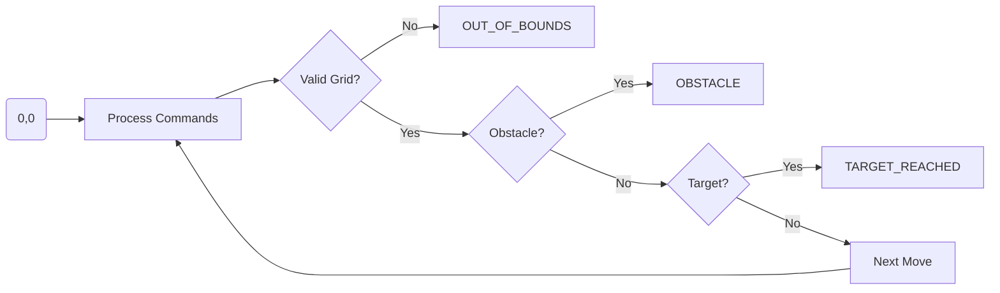
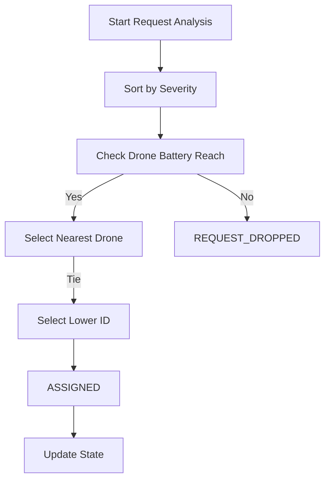

# ZYNOVA 2K26: CODATHON COMPLETE GUIDE

This document contains the official problem statements, technical constraints, sample test cases, and optimized C++ solutions for Zynova 2K26.

---

## Level 0 - (Medium Complexity)

## 1. Cinema Dynamic Pricing
### Problem Statement
A theater implements a dynamic pricing model based on the customer's age and the timing of the show. Calculate the ticket price based on:
- **Base Price:** Rs. 200.
- **Age Discounts:**
  - Children (Age < 12): 50% discount.
  - Senior Citizens (Age > 60): 30% discount.
- **Time Surcharge**: If the show is after 18:00 (6 PM), add Rs. 50 flat to the final price.

### Constraints
- $0 \le \text{Age} \le 120$
- $0 \le \text{Show Hour} \le 23$

### Input Format
- Two integers: `Age` and `Hour`.

### Output Format
- `Ticket Price: Rs. [Value]`

### Test Cases
| Case | Input | Expected Output | Explanation |
| :--- | :--- | :--- | :--- |
| Sample 1 | `10 19` | `Ticket Price: Rs. 150` | Age < 12 (100) + Night Surcharge (+50) |
| Sample 2 | `65 14` | `Ticket Price: Rs. 140` | Age > 60 (140) + No Surcharge |
| Sample 3 | `25 20` | `Ticket Price: Rs. 250` | Base (200) + Night Surcharge (+50) |

### Solution (C++)
```cpp
#include <iostream>
#include <iomanip>
using namespace std;

int main() {
    int age, hour;
    cin >> age >> hour;
    double price = 200.0;
    if (age < 12) price *= 0.5;
    else if (age > 60) price *= 0.7;
    if (hour >= 18) price += 50.0;
    cout << "Ticket Price: Rs. " << fixed << setprecision(0) << price << endl;
    return 0;
}
```

---

## 2. Smart Vending Machine
### Problem Statement
Optimal change calculation using the fewest coins for Rs. 10, 5, 2, and 1.

### Constraints
- $\text{Item Price} \le \text{Amount Paid}$
- All inputs are integers.

### Input Format
- `Item Price`, `Amount Paid`.

### Output Format
- `Change: 10x[a], 5x[b], 2x[c], 1x[d]`

### Test Cases
| Case | Input | Expected Output |
| :--- | :--- | :--- |
| Sample 1 | `37 100` | `Change: 10x6, 5x0, 2x1, 1x1` |
| Sample 2 | `10 20` | `Change: 10x1, 5x0, 2x0, 1x0` |

### Solution (C++)
```cpp
#include <iostream>
using namespace std;

int main() {
    int price, paid;
    cin >> price >> paid;
    int change = paid - price;
    int coins[] = {10, 5, 2, 1};
    int counts[4] = {0};
    for(int i=0; i<4; i++) {
        counts[i] = change / coins[i];
        change %= coins[i];
    }
    cout << "Change: 10x" << counts[0] << ", 5x" << counts[1] << ", 2x" << counts[2] << ", 1x" << counts[3] << endl;
    return 0;
}
```

---

## 3. Robot Path Validator
### Problem Statement
A robot moves on a 10x10 grid (0,0 to 9,9). Detect boundaries, obstacles, or target reaching.

### Constraints
- 10x10 Grid.
- Moves: U, D, L, R.

### Input Format
- Target X, Target Y
- Num Obstacles
- N pairs of Obstacle X, Y
- Moves String

### Output Format
- Status message: `TARGET_REACHED`, `OUT_OF_BOUNDS at (x,y)`, `OBSTACLE at (x,y)`, or `INCOMPLETE at (x,y)`.

### Test Cases
| Case | Input | Expected Output |
| :--- | :--- | :--- |
| Sample 1 | `2 2 1 1 1 RRUU` | `TARGET_REACHED` |
| Sample 2 | `5 5 0 L` | `OUT_OF_BOUNDS at (-1,0)` |

### Visual Representation


### Solution (C++)
```cpp
#include <iostream>
#include <string>
#include <set>
using namespace std;

int main() {
    int tx, ty, n;
    cin >> tx >> ty >> n;
    set<pair<int, int>> obs;
    for(int i=0; i<n; i++) { int ox, oy; cin >> ox >> oy; obs.insert({ox, oy}); }
    string s; cin >> s;
    int x = 0, y = 0;
    for(char c : s) {
        if(c == 'U') y++; else if(c == 'D') y--; else if(c == 'L') x--; else if(c == 'R') x++;
        if(x < 0 || x > 9 || y < 0 || y > 9) { cout << "OUT_OF_BOUNDS at (" << x << "," << y << ")" << endl; return 0; }
        if(obs.count({x, y})) { cout << "OBSTACLE at (" << x << "," << y << ")" << endl; return 0; }
        if(x == tx && y == ty) { cout << "TARGET_REACHED" << endl; return 0; }
    }
    cout << "INCOMPLETE at (" << x << "," << y << ")" << endl;
    return 0;
}
```

---

## 4. Real-time Health Alert System
### Problem Statement
Detect sustained Heart Rate (HR) abnormalities over 3-minute windows.
- **EMERGENCY**: HR > 150 for 3 consecutive minutes.
- **WARNING**: HR > 120 for 3 consecutive minutes (and not Emergency).

### Test Case
- **Input**: `80 90 125 130 128 100 90 155 160 165`
- **Output**: `Alert: EMERGENCY`

### Solution (C++)
```cpp
#include <iostream>
#include <vector>
using namespace std;

int main() {
    vector<int> hr(10);
    for(int i=0; i<10; i++) cin >> hr[i];
    bool e = false, w = false;
    for(int i=0; i<=7; i++) {
        bool we = true, ww = true;
        for(int j=0; j<3; j++) {
            if(hr[i+j] <= 150) we = false;
            if(hr[i+j] <= 120) ww = false;
        }
        if(we) e = true;
        if(ww) w = true;
    }
    if(e) cout << "Alert: EMERGENCY" << endl;
    else if(w) cout << "Alert: WARNING" << endl;
    else cout << "Status: STABLE" << endl;
    return 0;
}
```

---

## Level 1 - (Advanced Logic)

## 1. Precision Irrigation Assistant
### Problem Statement
Calculate water volume based on field area and moisture.
- Base: 5L per sq.m.
- Moisture < 30%: +25%.
- Moisture > 60%: -50%.
- Moisture > 80%: 0L.

### Test Cases
| Case | Input | Expected Output |
| :--- | :--- | :--- |
| Sample 1 | `100.0 25.0` | `Total: 625.0L` |
| Sample 2 | `50.0 70.0` | `Total: 125.0L` |

### Solution (C++)
```cpp
#include <iostream>
#include <iomanip>
using namespace std;

int main() {
    double a, m;
    cin >> a >> m;
    double v = a * 5.0;
    if(m > 80) v = 0; else if(m > 60) v *= 0.5; else if(m < 30) v *= 1.25;
    cout << "Total: " << fixed << setprecision(1) << v << "L" << endl;
    return 0;
}
```

---

## 2. Smart City Parking Fee
### Problem Statement
Billing based on duration, vehicle type (EV), and long-stay surcharge.
- First 2 hrs: Rs. 30.
- Extra: Rs. 20/hr.
- Surcharge: +10% if > 12 hrs.
- EV Discount: -Rs. 15 flat.

### Test Case
- **Input**: `5 1` (5 hours, is Electric Vehicle)
- **Calculation**: 30 (first 2h) + 3*20 (extra 3h) = 90. No surcharge. EV discount -15 = 75.
- **Output**: `Final Fee: Rs. 75.00`

### Solution (C++)
```cpp
#include <iostream>
#include <iomanip>
using namespace std;

int main() {
    int h, ev;
    cin >> h >> ev;
    double f = (h <= 2) ? 30 : 30 + (h-2)*20;
    if(h > 12) f *= 1.1;
    if(ev) f -= 15;
    cout << "Final Fee: Rs. " << fixed << setprecision(2) << f << endl;
    return 0;
}
```

---

## 3. Emergency Drone Deployment Optimizer
### Problem Statement
Assign drones to requests based on severity, distance, and battery.

### Logic Flow


### Solution (C++)
```cpp
#include <iostream>
#include <vector>
#include <cmath>
#include <algorithm>
using namespace std;

struct D { int id, b, x, y; };
struct R { int id, x, y, s; };

int main() {
    int dc; cin >> dc;
    vector<D> dv(dc);
    for(int i=0; i<dc; i++) cin >> dv[i].id >> dv[i].b >> dv[i].x >> dv[i].y;
    int rc; cin >> rc;
    vector<R> rv(rc);
    for(int i=0; i<rc; i++) cin >> rv[i].id >> rv[i].x >> rv[i].y >> rv[i].s;

    sort(rv.begin(), rv.end(), [](R a, R b){ 
        return (a.s != b.s) ? a.s > b.s : a.id < b.id; 
    });

    for(auto& r : rv) {
        int best = -1, min_d = 1e9;
        for(int i=0; i<dc; i++) {
            int d = abs(dv[i].x - r.x) + abs(dv[i].y - r.y);
            if(2*d <= dv[i].b) {
                if(d < min_d || (d == min_d && (best == -1 || dv[i].id < dv[best].id))) {
                    min_d = d; best = i;
                }
            }
        }
        if(best != -1) {
            cout << "ASSIGNED: " << dv[best].id << " -> " << r.id << endl;
            dv[best].b -= 2*min_d; dv[best].x = r.x; dv[best].y = r.y;
        } else cout << "REQUEST_DROPPED: " << r.id << endl;
    }
    return 0;
}
```
